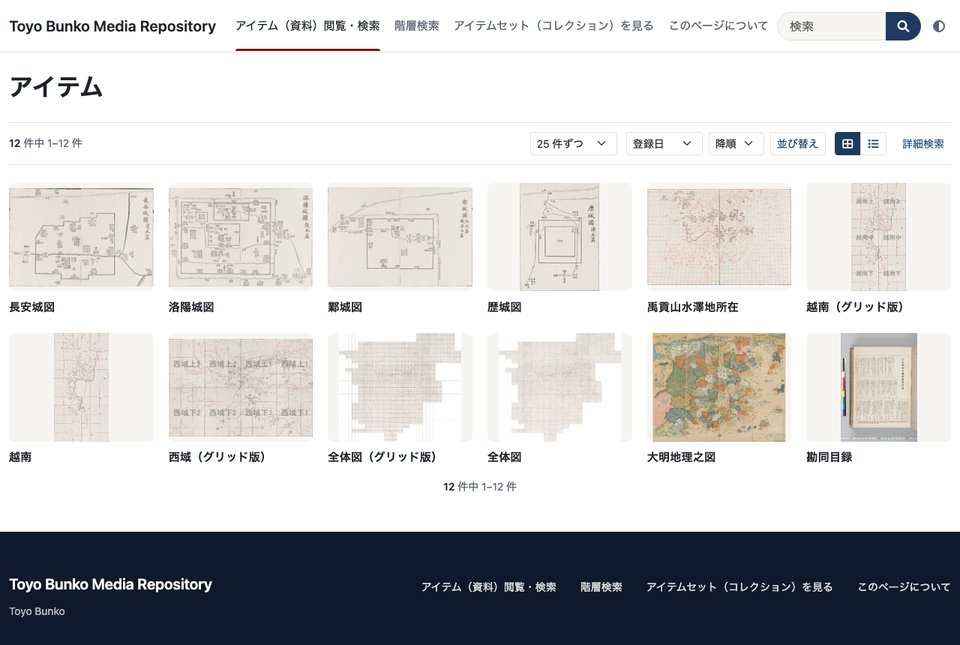

# Omeka-S-theme-Bootstrap5

A Bootstrap 5 theme for Omeka S 4.1 and later. Version 3 is rebuilt on the Omeka S 4.2.1 core
templates. It is used by the Toyo Bunko Media Repository (app.toyobunko-lab.jp).

Successor to [ldasjp8/Omeka-S-theme-Bootstrap5](https://github.com/ldasjp8/Omeka-S-theme-Bootstrap5)
(4.0.x) and to version 2 of this repository ("Bootstrap5 Modernized").
Version 3.0.0 is newer than ldasjp8's 4.0.x, although the number is smaller.
The theme's version numbers do not follow those of Omeka S.

日本語の説明は下にあります。

## Features

- Light and dark mode. A switch in the header offers light, dark and "same as the device";
  the browser remembers the choice.
- Two color settings, main and accent. Text tints for dark mode are derived from them.
- Browse pages as a grid or a list, with a page size selector (default, 50, 100).
- Item and media pages with breadcrumbs and a row of actions: copy the URL, a citation to copy
  (Japanese or English form, following the page language), share to X / Facebook / email,
  the IIIF manifest (with the IIIF logo) and the JSON-LD data.
- Open Graph and Twitter card tags, so shared links show the title, description and image.
- Sticky header on wide screens, print styles.
- Japanese translation.
- Bootstrap CSS 5.3.8 and Font Awesome Free 6 are bundled; nothing is loaded from a CDN.
  Bootstrap's JavaScript is not used.

## Installation

1. Download the release zip, or clone this repository, into `themes/` of your Omeka S.
   Keep the folder name `Omeka-S-theme-Bootstrap5`.
2. In the admin, open **Sites → your site → Theme**, choose "Bootstrap 5" and adjust the settings.

Omeka S stores theme settings under the theme's folder name. If you replace an earlier version
in the same folder, its settings are kept.

## Settings

| Setting | Use |
| --- | --- |
| Main color / Accent color | Buttons, links, footer background / home banner button, current menu mark |
| Footer Content | HTML shown in the footer |
| Site Sub Title | HTML shown under the site title on the home banner |
| Top Image / Top Button url | Home banner image and the target of its button |
| Sort properties | Extra sort options on browse pages, one `term,Label` per line |
| Body properties | Values shown under titles in list view, one `term,Label` per line |
| Layout for Browse Pages | Grid or list as the default |
| Advanced Search URL | Another search page (for example a module's) instead of the core one |

"Show a link to collections in item pages?" is kept so that old settings load, but it has no
effect, as in 4.0.x.

## Upgrading from version 2

- `hero_image`, `hero_button_url` and `hero_button_text` are still read when `top_image` and
  `top_url` are empty.
- `list_display_properties` and `thumbnail_display_mode` are no longer used. Use
  "Body properties" for the values under titles.
- The hero carousel and the faceted search sidebar are gone.

## Upgrading from ldasjp8/Omeka-S-theme-Bootstrap5 4.0.x

The setting names are the same. Put version 3 in the same folder and the settings carry over.
Then set the main and accent colors, which are new.

## Development

`scripts/dev/setup.zsh` starts a local Omeka S with [DDEV](https://ddev.com/) and copies a few
public items from a live site through its API. See the comments at the top of the script.

The first commit of the version 3 history holds the Omeka S 4.2.1 core templates as they are,
so `git log -p -- view/<path>` shows what the theme changed.

## License

GPLv3, as the theme contains Omeka S core templates.
Bundled: Bootstrap (MIT), Font Awesome Free (icons CC BY 4.0, fonts SIL OFL 1.1, code MIT),
IIIF logo (from iiif.io).

---

## 日本語

Omeka S 4.1 以降で使える Bootstrap 5 のテーマです。第3版は、Omeka S 4.2.1 の本体テンプレートを土台に作り直しました。
東洋文庫メディアリポジトリ（app.toyobunko-lab.jp）で使っています。

主な機能:

- ライトとダークの切り替え（ヘッダー右端。端末の設定に合わせることもできます）
- メインの色とアクセントの色の設定
- 一覧のグリッドとリストの切り替え、表示件数の切り替え
- 資料の画面に、パンくず、URL のコピー、引用（日本語の形）、共有、IIIF マニフェスト、JSON-LD
- 共有したときに題名と画像が出る設定（OGP）

入れ方: `themes/` の下に、フォルダ名 `Omeka-S-theme-Bootstrap5` のまま置きます。
同じフォルダ名で古い版と置き換えると、テーマの設定はそのまま引き継がれます。
第2版の `hero_*` の設定も読みます。

3.0.0 は ldasjp8/Omeka-S-theme-Bootstrap5 4.0.x の後継です（番号は小さくなりましたが、新しい版です）。
テーマの版番号は、Omeka S の版番号とは対応していません。
